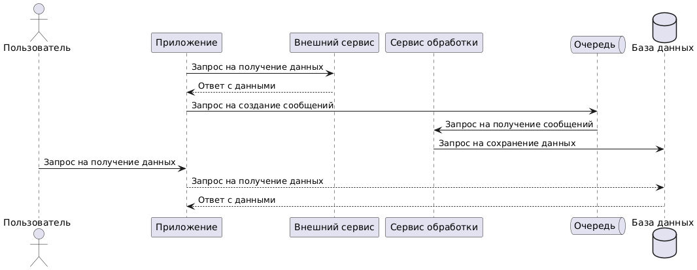
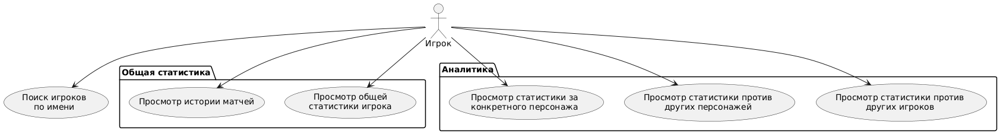

### Требование к структуре АС в целом

Подсистемы:

- API, обеспечивает взаимодейсвтие между клиентским приложением, предоставляет возможности поиска игроков и получения статистики
- Сервис обработки данных, осуществляет хранение данных о матчах
- Сервис взаимодействия со сторонним поставщиков данных, осуществляет периодические запросы к серверам Tekken 8 для получения информации о матчах

Информационное взаимодействие между сервисом обработки данных и сервисом взаимодействия со сторонним поставщиком обеспечивается с использованием брокера сообщений.



### Требования к функциям выполняемым АС



- Поиск игроков по имени. Результат: список игроков с ссылками на их профиль
- Просмотр истории матчей. Результат: список матчей конкретного игрока
- Просмотр общей статистики игрока. Результат: общее количество матчей, побед и поражений игрока
- Просмотр статистики за конкретного персонажа. Результат: список матчей за выбранного персонажа, количество матчей, рейтинг, количество побед и поражений, дата последней игры
- Просмотр статистики против других персонажей. Результат: список матчей против выбранного персонажа. Количество матчей, количество побед и поражений, дата последней игры.
- Просмотр статистики против других игроков. Результат: список матчей против другого игрока. Количество матчей, количество побед и поражений, дата последней игры.

### Требования к видам обеспечения АС

- Данные в АС представлены в виде документов, где каждый документ представляет собой игрока, его историю матчей, историю имен и информацию о персонажах
  ```json
  [
    {
      "_id": "2HqhnrTt2h2J",
      "Characters": [
        {
          "CharacterId": 2,
          "MatchesCount": 7,
          "WinCount": 5,
          "LossCount": 2,
          "Rating": 1290,
          "LastPlayed": { "$date": "2025-03-28T04:48:21.000Z" }
        }
      ],
      "CurrentName": "是阿南啦!",
      "Matches": [
        {
          "BattleId": "6811B55E882F426DA6E5D5F59866EF41",
          "Date": { "$date": "2025-03-28T01:33:00.000Z" },
          "GameVersion": 11300,
          "Winner": true,
          "Challenger": {
            "CharacterId": 2,
            "Rounds": 3,
            "RatingBefore": 1282,
            "RatingChange": 9
          },
          "Opponent": {
            "CharacterId": 12,
            "Rounds": 0,
            "RatingBefore": 1250,
            "RatingChange": -11,
            "TekkenId": "3m2qmf4JnfQE"
          }
        }
      ],
      "Names": [
        {
          "PlayerName": "是阿南啦!",
          "Date": { "$date": "2025-03-28T04:38:57.861Z" }
        }
      ],
      "Power": 140094,
      "Rank": 18
    }
  ]
  ```
- Применяется документоориентированная база данных для хранения информации о игроках, реляционная база данных для хранения информации об обработанных сообщениях и персонажах

- Брокер сообщений для взаимодейсвтия между подсистемами и асинхронной обработки данных

### Общие технические требования к АС

- Безопасность: HTTPS, защита от XSS-атак
- Масштабируемость: возможность горизонтального масштабирования
- Совместимость: поддержка Linux для серверной части
- Надежность: восстановление после сбоев
